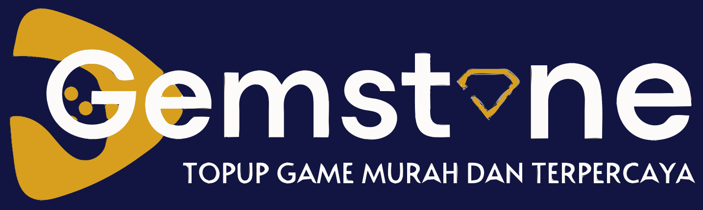

## Gemstone

<h2 align="center"> Web Topup Game dan Pulsa</h2>

<h4>Cara Install : </h4>
+ composer install 
+ npm install  
+ npm run dev 
+ php artisan migrate 
+ php artisan key:generate 
+ php artisan storage:link 
+ php artisan serve 

Laravel is accessible, powerful, and provides tools required for large, robust applications.

If you discover a security vulnerability within Laravel, please send an e-mail to Taylor Otwell via [taylor@laravel.com](mailto:taylor@laravel.com). All security vulnerabilities will be promptly addressed.

## License

The Laravel framework is open-sourced software licensed under the [MIT license](https://opensource.org/licenses/MIT).
